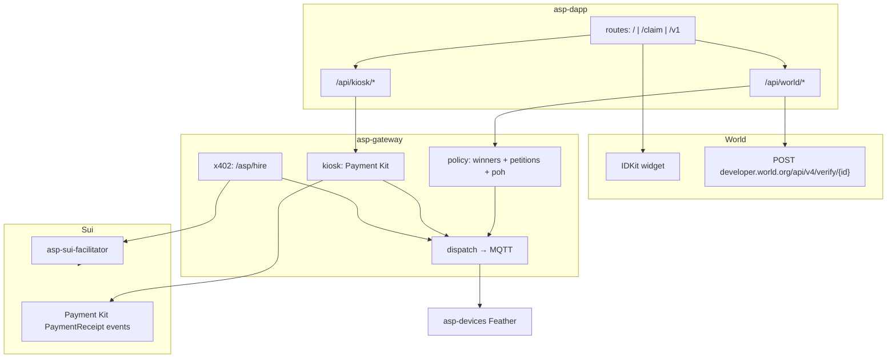
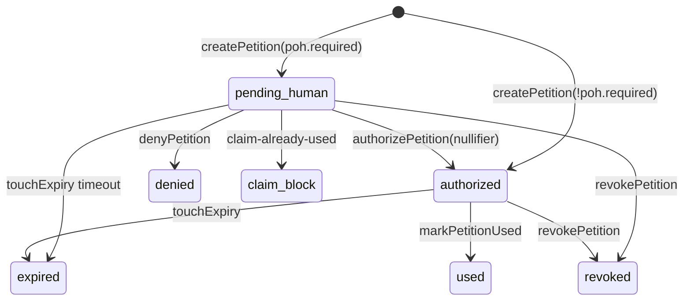

# AGENT.md — Asp integration contract

Technical reference for **automated buyers / orchestrators** that call Asp over HTTP + MQTT, and for auditors reviewing those paths. Product pitch for people: [`README.md`](./README.md). Booth walkthrough: [`SIMULATOR.md`](./SIMULATOR.md).

| Field | Value |
|---|---|
| Product | Asp / AntiScalper Protocol |
| Event | ETHGlobal Tokyo 2026 |
| Rails | World (Proof of Human), Sui (settlement) |
| Trust model | Fail-closed. Never treat client `onSuccess` or a local `paid=true` as authority. |

---

## 0. Invariants

1. `client_idkit_onSuccess ≠ authorization`
2. `payment_received ≠ entitlement`
3. `authorized_petition ∧ settled_payment ∧ unused_claim → at_most_one MQTT dispense`
4. Same World `nullifier` cannot successfully claim the same `release_id` twice
5. Ticket `WIN-*` binds to one nullifier; claim must present matching nullifier
6. Claim World proof `signal` SHOULD equal `petition_id`
7. Lab Payment Kit intents NEVER dispatch motor (`lab-intent-no-dispense`)
8. In-memory stores (winners, petitions, intents) RESET on gateway process restart
9. Physical dispense is MQTT single-shot; lab Payment Kit paths never arm the motor

---

## 1. System graph



---

## 2. Constants / identifiers

| Symbol | Value | Where |
|---|---|---|
| `ENROLL_ACTION` | `asp-enroll-tokyo2026-capsule-v1` | `asp-dapp/src/features/hire/gateway.ts` |
| `RELEASE_ID` | `tokyo2026-capsule-v1` | same |
| Ticket format | `WIN-` + 6 alnum uppercase | `winners.js` `makeTicket()` |
| Petition id prefix | `pet_` | `store.js` `makeId('pet')` |
| Demo ticket storage key | `asp.demoTicket.v1` | `aspDemoTicket.ts` (browser only; not auth) |
| MQTT passive action | `asp/passive/{deviceId}/action` | `dispatcher.js` |
| MQTT active intent | `asp/active/{deviceId}/intent` | `dispatcher.js` |
| MQTT receipt suffix | `/receipt` | `resolveReceipt` |
| Default Payment Kit pkg | `0xbc126f1535fba7d641cb9150ad9eae93b104972586ba20f3c60bfe0e53b69bc6` | `paymentKit.js` |
| Env gateway URL | `EXPO_PUBLIC_GATEWAY_URL` | dapp |
| Env facilitator | `FACILITATOR_URL` | gateway settings |
| Env World | `WORLD_APP_ID`, `WORLD_RP_ID`, `WORLD_STAGING_VERIFICATION_TOKEN`, `EXPO_PUBLIC_WORLD_ENVIRONMENT` | dapp+gateway |

---

## 3. State machines

### 3.1 Petition (`store.js`)

```
statuses ∈ {
  pending_human,   # PoH required, not yet authorized
  authorized,      # may create pay intent / hire
  used,            # dispense completed / marked used
  expired,         # past expires_at
  revoked,
  denied
}
```



Fields (record):

```json
{
  "petition_id": "pet_…",
  "requester": "kiosk|0x…|agent",
  "target_hardware_id": "Sub_…",
  "command": ["DISPENSE_ONCE"],
  "max_amount": "string",
  "release_id": "tokyo2026-capsule-v1|null",
  "status": "pending_human|authorized|…",
  "proof_of_human": { "required": true, "freshness_seconds": 300, "release_id": "…" },
  "release_action": "asp-release-{release_id}|null",
  "job_action": "asp-job-{petition_id}",
  "created_at": 0,
  "expires_at": 0,
  "authorized_at": null,
  "used_at": null,
  "nullifier": null,
  "subject_ref": null
}
```

### 3.2 Winner ticket (`winners.js`)

```json
{
  "ticket": "WIN-ABC123",
  "nullifier": "lowercase-hex-or-string",
  "release_id": "tokyo2026-capsule-v1",
  "session_id": null,
  "enrolled_at": 0,
  "claimed_at": null,
  "last_petition_id": null
}
```

Maps: `ticket → record`, `nullifier → ticket`, `session_id → ticket`.

### 3.3 Product UI phases (checkout)

Informal UI phases in `useCheckoutFlow.ts` / `useDemoV1Flow.ts`:
`idle → awaiting_human → authorized/ready → awaiting_payment (QR) → polling → complete|error|denied`

---

## 4. World rail — contracts

### 4.1 Preferred verify topology

```
IDKit proof
  → asp-dapp verifies at World portal (fresh WORLD_STAGING_VERIFICATION_TOKEN + User-Agent)
  → asp-gateway authorize-preverified | winners/register (preverified:true)
```

Do NOT prefer gateway-side World verify for live demo (token staleness → 403).

### 4.2 Dapp World API

#### `POST /api/world/rp-signature`

| | |
|---|---|
| FILE | `asp-dapp/src/app/api/world/rp-signature+api.ts` |
| AUTH | server-only `WORLD_RP_SIGNING_KEY` |
| BODY | `{ action?: string, session?: boolean }` |
| RULE | uniqueness: pass `action`; session create/prove: `{ session:true }` omit action |
| OUT | signed request for IDKit |

#### `POST /api/world/enroll`

| | |
|---|---|
| FILE | `asp-dapp/src/app/api/world/enroll+api.ts` |
| BODY | `{ idkitResponse, action?, signal? }` |
| STEPS | portal verify → extract nullifier → `POST {GATEWAY}/asp/winners/register` with `preverified:true` |
| OUT | `{ ok, ticket, winner, … }` |
| FAIL | `missing-idkit-response`, `world-ids-missing`, `world-verify-failed`, `missing-nullifier`, gateway 502 |

#### `POST /api/world/poh-verify`

| | |
|---|---|
| FILE | `asp-dapp/src/app/api/world/poh-verify+api.ts` |
| BODY | `{ petition_id, idkitResponse, action?, signal?, ticket? }` |
| DEFAULT_ACTION | `asp-enroll-tokyo2026-capsule-v1` |
| STEPS | portal verify → `POST {GATEWAY}/asp/proof-of-human/authorize-preverified` |
| OUT | `{ ok, via:'dapp-verify+preverified-authorize', …gateway }` |
| FAIL | `missing-petition_id`, `world-verify-failed`, `missing-nullifier`, `authorize-failed`, `claim_already_used` |

#### `POST /api/world/enroll-session` / session bind

Secondary World ID 4.0 session path. Production signup prefers legacy uniqueness enroll (`enroll`). Files: `enroll-session+api.ts`, `WorldSessionModal.tsx`.

#### `POST /api/world/verify-proof`

Lab-only isolated verify. File: `verify-proof+api.ts`.

### 4.3 Gateway policy HTTP

Base: gateway `EXPO_PUBLIC_GATEWAY_URL` / `ASP_GW_HTTP_PORT`.

#### `POST /asp/petition`

```json
// request
{ "requester": "kiosk", "target_hardware_id": "Sub_…", "command": ["DISPENSE_ONCE"] }
// response (poh required)
{
  "ok": true,
  "petition": { "petition_id": "pet_…", "status": "pending_human", … },
  "next": {
    "message": "…",
    "verify_url": "/asp/proof-of-human/verify"
  }
}
```

FILE: `asp-gateway/src/services/policy/routes.js` → `createPetition` in `store.js`.

#### `GET /asp/petition/:id`

Return petition record or 404.

#### `POST /asp/proof-of-human/authorize-preverified`

```json
{
  "petition_id": "pet_…",
  "ticket": "WIN-…",
  "nullifier": "…",
  "session_id": "…",
  "signal": "pet_…",
  "preverified": true
}
```

Checks: petition exists, not expired, ticket/nullifier via `assertWinnerCanClaim`, signal match when provided, `authorizePetition`, claim-already-used.

#### `POST /asp/proof-of-human/verify`

Gateway calls `verifyWorldProof` then authorize. Prefer dapp `poh-verify` in production demo.

#### `POST /asp/winners/register`

```json
{
  "nullifier": "…",
  "release_id": "tokyo2026-capsule-v1",
  "preverified": true
}
```

→ `enrollWinner`.

#### `POST /asp/winners/enroll` | `enroll-session` | `bind-session`

Alternate enroll paths. See `routes.js` + `winners.js`.

#### `GET /asp/winners/:ticket` | `GET /asp/winners`

Lookup / list.

#### `POST /asp/proof-of-human/revoke` | `deny`

Terminal negative states.

#### `POST /asp/demo/reset-claims`

Clears claim registers for repeatable booth demo.

### 4.4 `verifyWorldProof` semantics

FILE: `asp-gateway/src/services/policy/pohVerify.js`

INPUT: IDKit response object + `{ expectedEnvironment, action, signal }`  
PROCESS:

1. Build verify id list: `rp_*` then `app_*`
2. Detect session proof vs uniqueness
3. Forward JSON to `https://developer.world.org/api/v4/verify/{id}`
4. Attach `x-staging-verification-token` when set
5. Require HTTP ok AND success flag
6. Extract nullifier / session_id
7. Optional env mismatch → `environment-mismatch`

OUTPUT:

```json
{ "verified": true|false, "nullifier": "…"|null, "session_id": "…"|null, "raw": {}, "error": "…" }
```

### 4.5 World error catalog

| code | meaning | agent action |
|---|---|---|
| `missing-idkit-response` | no proof | abort |
| `world-ids-missing` | env misconfig | abort / alert operator |
| `world-verify-failed` | portal reject | abort; refresh staging token if 401/403 |
| `missing-nullifier` | session-only without uniqueness | use uniqueness enroll path |
| `unknown-ticket` | not enrolled | send human to `/` Get |
| `already-claimed` | ticket redeemed | stop; motor must idle |
| `nullifier-mismatch` | different human | stop |
| `signal-mismatch` | wrong petition binding | redo PoH with signal=petition_id |
| `claim-already-used` | release nullifier spent | stop; product success for anti-scalp |
| `pending-human` | hire/pay too early | complete PoH first |
| `expired` | petition freshness elapsed | new petition |
| `environment-mismatch` | sandbox vs prod proof | align env |

---

## 5. Sui rail — contracts

Two parallel payment channels. Do not conflate.

| Channel | Who | Settle proof | Dispense entry |
|---|---|---|---|
| **A Payment Kit / Slush QR** | human phone at booth | `PaymentReceipt` event by `nonce` | `POST /asp/kiosk/complete` or `/dispense` |
| **B x402 hire** | agent/chat | x402 facilitator settle | `POST /asp/hire` after 402 dance |

Both require `assertHireAllowed` before motor.

### 5.1 Channel A — Payment Kit

#### Build pay URL

FILE: `asp-gateway/src/services/kiosk/paymentKit.js`  
FN: `buildSlushPayUrl({ receiver, amount, coinType, nonce, label, message })`  
OUT:

```json
{
  "deepLink": "slush://pay?…",
  "webUrl": "https://my.slush.app/pay?…",
  "suiPay": "sui:…",
  "payUrl": "slush://pay?…"
}
```

Uses `@mysten/payment-kit` `createPaymentTransactionUri`.

#### Lookup settlement

FN: `lookupPaymentRecord({ nonce, amount, coinType, receiver })`  
RPC: `suix_queryEvents` filter `MoveEventType = {PAYMENT_KIT_PACKAGE}::payment_kit::PaymentReceipt`  
MATCH: `nonce` (+ optional amount/receiver)  
OUT: `{ nonce, amount, receiver, paymentTransactionDigest, event }` OR `null`

#### Gateway kiosk routes

FILE: `asp-gateway/src/services/kiosk/routes.js`

| Method | Path | Precondition | Behavior |
|---|---|---|---|
| POST | `/asp/kiosk/intent` | petition `authorized` | create intent + Slush URIs |
| POST | `/asp/kiosk/lab/intent` | none | pay-only lab; no motor |
| GET | `/asp/kiosk/intent/:nonce` | intent exists | poll + `lookupPaymentRecord` |
| POST | `/asp/kiosk/dispense` | intent + paid | assertHireAllowed → MQTT |
| POST | `/asp/kiosk/complete` | body has nonce+petition fields | re-lookup pay → gate → MQTT |
| POST | `/asp/kiosk/reset` | demo | clear intents |

`POST /asp/kiosk/intent` body:

```json
{ "petition_id": "pet_…" }
```

Errors: `missing-petition_id`, `petition-not-found`, `pending-human`, `petition-already-used`, `expired`, `pay-url-failed`, `gateway-address-missing`.

`POST /asp/kiosk/complete` errors: `missing-fields`, `payment-not-found` (HTTP **402**), `payment-lookup-failed` (502), gate errors, `esp32-no-receipt` (504), `lab-intent-no-dispense`.

#### Dapp kiosk proxies

| Path | File | Role |
|---|---|---|
| `POST /api/kiosk/checkout-intent` | `checkout-intent+api.ts` | UI checkout QR |
| `GET /api/kiosk/status?nonce=` | `status+api.ts` | poll |
| `POST /api/kiosk/complete` | `complete+api.ts` | proxy complete |
| `POST /api/kiosk/lab-intent` | `lab-intent+api.ts` | lab QR |

Client helpers: `asp-dapp/src/features/hire/gateway.ts`  
(`createCheckoutPayIntent`, `completeKioskCheckout`, `createKioskIntent`, …)  
QR UI: `PayQr.tsx`  
Poll loop: `useCheckoutFlow.ts`, `useDemoV1Flow.ts`

### 5.2 Channel B — x402 hire

FILE: `asp-gateway/src/services/x402/routes.js`

```
POST /asp/hire
  1. parse petition/skill
  2. assertHireAllowed({ skill, body: petition })  // BEFORE payment
  3. x402ResourceServer + HTTPFacilitatorClient(FACILITATOR_URL)
  4. feePayer: 'facilitator', exact Sui scheme
  5. on settle → dispatch MQTT → markPetitionUsed
```

Related discovery:

- `GET /asp/agent-guide.json`
- `GET /asp/skills`
- HTML agent docs under x402 router (`/agentic`, etc.)

Facilitator package: `asp-sui-facilitator` (`POST /sponsor`, `/verify`, `/settle` — see that package).

SDK: `@altaga/x402-sui` (`x402ResourceServer`, `HTTPFacilitatorClient`, Exact Sui schemes).

### 5.3 `assertHireAllowed` gate

FILE: `asp-gateway/src/services/policy/store.js`

Checks (non-exhaustive): petition exists; status `authorized`; not expired; requester match (unless skipped); PoH/nullifier/claim constraints; amount/skill alignment.

Return shape on fail: `{ ok:false, error, status, detail, claim_already_used? }`.

---

## 6. Dispatch / hardware

FILE: `asp-gateway/src/services/dispatch/dispatcher.js`

```
makeDispatch(mqttBroker, log)(petition, skill)
  if skill.execution_model === 'AGENTIC':
    publish asp/active/{target}/intent
    await receipt (timeout 120s)
  else:
    publish asp/passive/{target}/action  # command array / DISPENSE_ONCE
    await receipt (timeout ~15s)
```

`resolveReceipt`: match `tx_id` in-flight; fallback only if topic ends with `/receipt`.

DEVICE: `asp-devices` Feather firmware — subscribe action, spin once, publish receipt.  
Wiring/README: `asp-devices/README.md`.

---

## 7. Canonical sequences

### 7.1 Human Get ticket

```
1 UI / → WorldVerifyModal
2 POST /api/world/rp-signature { action: ENROLL_ACTION }
3 IDKit uniqueness proof
4 POST /api/world/enroll { idkitResponse, action }
5 dapp → World portal verify
6 dapp → POST /asp/winners/register { nullifier, release_id, preverified:true }
7 return ticket WIN-*
8 optional localStorage asp.demoTicket.v1
```

### 7.2 Human Claim + pay + motor

```
1 UI /claim enter ticket → GET /asp/winners/:ticket (must exist, !claimed_at)
2 POST /asp/petition { requester:'kiosk', target_hardware_id, command:['DISPENSE_ONCE'] }
3 status pending_human
4 WorldVerifyModal action=ENROLL_ACTION signal=petition_id ticket=WIN-*
5 POST /api/world/poh-verify { petition_id, idkitResponse, action, signal, ticket }
6 gateway authorize-preverified → status authorized
7 POST /api/kiosk/checkout-intent { petition_id }
8 show PayQr(slush://…)
9 loop GET /api/kiosk/status?nonce= until payment record
10 POST /api/kiosk/complete { nonce, petition_id, … }
11 gateway lookupPaymentRecord + assertHireAllowed + MQTT
12 mark petition used + markWinnerClaimed
13 UI success; second attempt → claim-already-used | already-claimed
```

### 7.3 Backup /v1 (no ticket)

```
Same as claim but skip ticket enroll gate; uniqueness PoH per demo flow;
deny on claim-already-used for release nullifier.
Files: useDemoV1Flow.ts, DemoV1Page.tsx
```

### 7.4 Agent hire

```
1 POST /asp/petition
2 Instruct human PoH (or Agents plugin flow) → authorize
3 POST /asp/hire with x402 payment headers / client retry after 402
4 facilitator sponsors gas
5 dispatch + mark used
```

---

## 8. File index

### World / policy

| Path | Exports / role |
|---|---|
| `asp-gateway/src/services/policy/pohVerify.js` | `verifyWorldProof` |
| `asp-gateway/src/services/policy/winners.js` | `enrollWinner`, `assertWinnerCanClaim`, `markWinnerClaimed`, … |
| `asp-gateway/src/services/policy/store.js` | petitions + `assertHireAllowed` |
| `asp-gateway/src/services/policy/routes.js` | HTTP policy router |
| `asp-dapp/src/features/world/WorldVerifyModal.tsx` | IDKit UI |
| `asp-dapp/src/features/world/WorldSessionModal.tsx` | session UI |
| `asp-dapp/src/features/hire/gateway.ts` | typed client to gateway + dapp proxies |
| `asp-dapp/src/app/api/world/*` | enroll, poh-verify, rp-signature, … |

### Sui / kiosk / x402

| Path | Exports / role |
|---|---|
| `asp-gateway/src/services/kiosk/paymentKit.js` | `buildSlushPayUrl`, `lookupPaymentRecord` |
| `asp-gateway/src/services/kiosk/routes.js` | kiosk HTTP |
| `asp-gateway/src/services/kiosk/intentStore.js` | intent CRUD |
| `asp-gateway/src/services/x402/routes.js` | `/asp/hire`, agent-guide |
| `asp-dapp/src/features/kiosk/paymentLab.ts` | client Payment Kit helpers |
| `asp-dapp/src/app/api/kiosk/*` | checkout-intent, status, complete, lab-intent |
| `asp-sui-facilitator/` | gas station |

### Dispatch / device

| Path | Role |
|---|---|
| `asp-gateway/src/services/dispatch/dispatcher.js` | MQTT publish + receipt wait |
| `asp-devices/` | firmware |

### UI orchestration

| Path | Role |
|---|---|
| `asp-dapp/src/features/control/SignupPage.tsx` | Get ticket |
| `asp-dapp/src/features/control/CheckoutPage.tsx` | Claim |
| `asp-dapp/src/features/control/useCheckoutFlow.ts` | claim state machine |
| `asp-dapp/src/features/control/DemoV1Page.tsx` | backup |
| `asp-dapp/src/features/control/useDemoV1Flow.ts` | backup state machine |
| `asp-dapp/src/features/control/PayQr.tsx` | QR |
| `asp-dapp/src/app/index.tsx` | `/` → SignupPage |
| `asp-dapp/src/app/claim.tsx` | `/claim` → CheckoutPage |
| `asp-dapp/src/app/v1.tsx` | `/v1` → DemoV1Page |

---

## 9. Env checklist (operator)

Gateway `.env.example` keys (no secrets in git):

- `GATEWAY_PRIVATE_KEY`, `GATEWAY_ADDRESS`
- `SUI_RPC_URL`, `SUI_GRPC_URL`, `SUI_NETWORK`
- `MQTT_BROKER_URL`, `MQTT_BROKER_JWT`
- `FACILITATOR_URL`
- `WORLD_APP_ID`, `WORLD_RP_ID`, `WORLD_ENVIRONMENT`, `WORLD_STAGING_VERIFICATION_TOKEN`
- `ASP_GW_HOST`, `ASP_GW_HTTP_PORT`

Dapp:

- `EXPO_PUBLIC_GATEWAY_URL`
- `EXPO_PUBLIC_WORLD_*`
- `WORLD_RP_SIGNING_KEY` (server only)
- `WORLD_STAGING_VERIFICATION_TOKEN`

---

## 10. Integration mistakes that break the product

1. Treating the IDKit client callback as sufficient authorization
2. Setting `paid=true` without a `PaymentReceipt` / x402 settle proof
3. Calling `/asp/hire` or kiosk complete while the petition is `pending_human`
4. Retrying dispense after `claim-already-used` and expecting success
5. Using the lab intent path when a physical motor dispense is required
6. Logging or committing private keys, JWTs, or staging tokens

---

## 11. Minimal logical self-test

```
T1 enroll → ticket T
T2 petition → pending_human
T3 poh-verify wrong nullifier → fail
T4 poh-verify correct → authorized
T5 checkout-intent → nonce N
T6 status before pay → payment-not-found
T7 pay → status has digest
T8 complete → MQTT receipt ok
T9 complete/claim again → claim-already-used | already-claimed
T10 hire without authorize → pending-human
```

---

## 12. Related docs

- Product pitch / diagrams: `README.md`
- Booth walkthrough: `SIMULATOR.md`
- This file: HTTP/MQTT integration contract for automated clients and auditors
