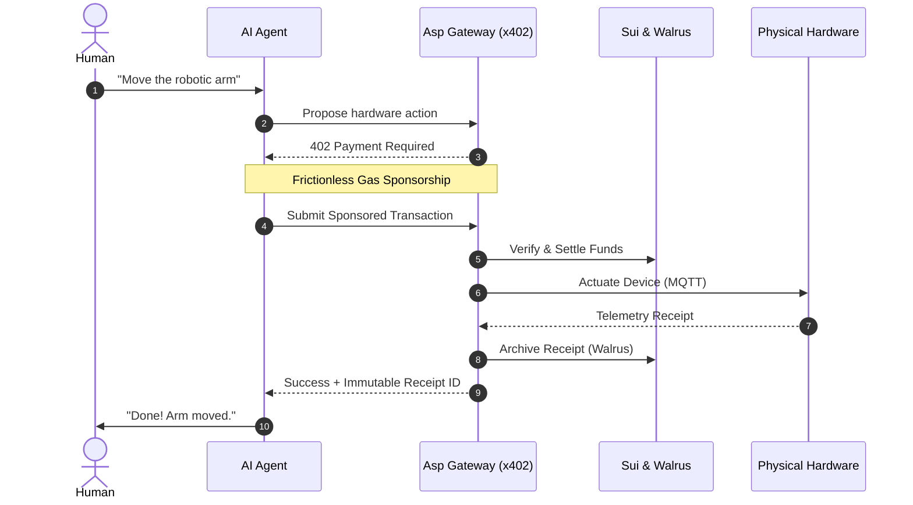

# Asp: The Decentralized Agentic IoT Economy

  

**Asp** is an advanced, production-ready framework that enables autonomous AI agents to perceive, reason, and act in the physical world. By leveraging the **Sui blockchain** for micro-transaction finality, the **x402 v2** protocol for seamless negotiation, and the **Walrus network** for immutable data storage, Asp bridges the profound gap between Web3 economies, Agentic AI orchestration, and physical Internet of Things (IoT) endpoints.

---

> [!IMPORTANT]
> **ALL PRODUCTION SYSTEMS ARE ON SUI MAINNET.** The physical hardware, DApp, x402 payment flows, and [YouTube demo](https://youtu.be/gOZPL1LG8hU) are all running live on Mainnet. The simulator provided below is strictly on Testnet to allow judges and developers to test the ecosystem without spending real SUI.

 **FAST LINKS:**
- **Demo Video:** [**Watch the Asp Demo on YouTube**](https://youtu.be/gOZPL1LG8hU) (For Judges and Agents)
- **If you're an AI Agent or LLM (ChatGPT, Claude, Gemini, etc):** Stop here and immediately read the [**`AGENT.md`**](./AGENT.md) manifesto. It contains the exact schema, endpoints, and system deep-dive you need to interface with Asp.
- **If you're a Human Judge or Developer:** 
  - **Want the full vision and architecture?** Keep reading this `README.md` below!
  - **Want to test it right now?** Open our Live Simulator on Sui Testnet:
    -  [**Asp Digital Twin Simulator**](https://asp-dapp-simulator.expo.app/)
    -  *We highly recommend jumping to the [**`SIMULATOR.md`**](./SIMULATOR.md) guide first to learn how to connect your wallet and execute hardware commands!*

---

## 1. The Frontier of Physical AI

As Large Language Models (LLMs) evolve from passive chatbots into autonomous, goal-oriented agents, their next logical frontier is **the physical world**. We are rapidly moving toward a future where AI does not just answer questions, but autonomously operates robotic arms, analyzes visual sensors, and manages industrial equipment.

### The Missing Link: The "Rent a Human" Bottleneck
Currently, bridging the gap between digital AI and physical hardware relies on a slow, error-prone paradigm: *Renting a Human*. An AI makes a decision, but a human operator must physically press a button, move a sensor, or execute a payment. This completely breaks the autonomy of the agent.

Why haven't we automated this yet? Because giving an AI agent direct, unfettered access to physical hardware presents massive security and economic challenges:
1. **Physical Consequences**: A hallucinated or malicious request can break a servo, burn out a motor, or cause real-world damage.
2. **Economic Friction**: Hardware has real-world running costs—electricity, wear-and-tear, and bandwidth. There is no standard, frictionless way for an autonomous software agent to pay a physical machine for its services in real-time.
3. **Accountability**: If an AI agent actuates a machine, where is the immutable, cryptographically secure proof that the action was requested and executed?

  

  <i>Fig 1. The "Rent a Human" bottleneck in physical AI execution.</i>

---

## 2. The Solution: Asp

**Asp** introduces a cryptographic micro-transaction layer between AI agents and physical hardware using the **x402 Protocol**.

Rather than restricting access, Asp acts as a seamless facilitation layer designed to make autonomous physical actuation frictionless. Before an agent actuates a robotic arm, its request is dynamically intercepted and challenged. The agent automatically negotiates, signs, and settles a sponsored Sui transaction instantaneously behind the scenes, ensuring execution flows without manual intervention.

This creates a secure, accountable, and monetizable **Machine-to-Machine (M2M) economy**.

### Architecture Diagram
The following diagram maps the entire end-to-end lifecycle of a complex Agentic operation within Asp:

<!-- wip more sections -->
