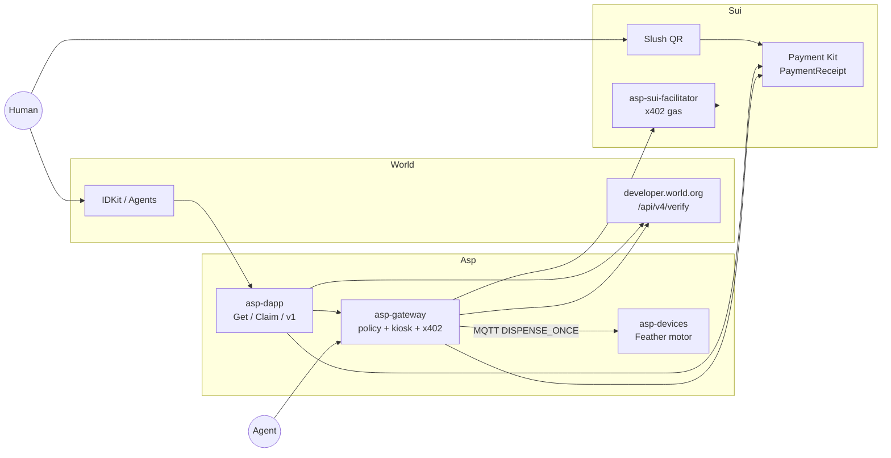
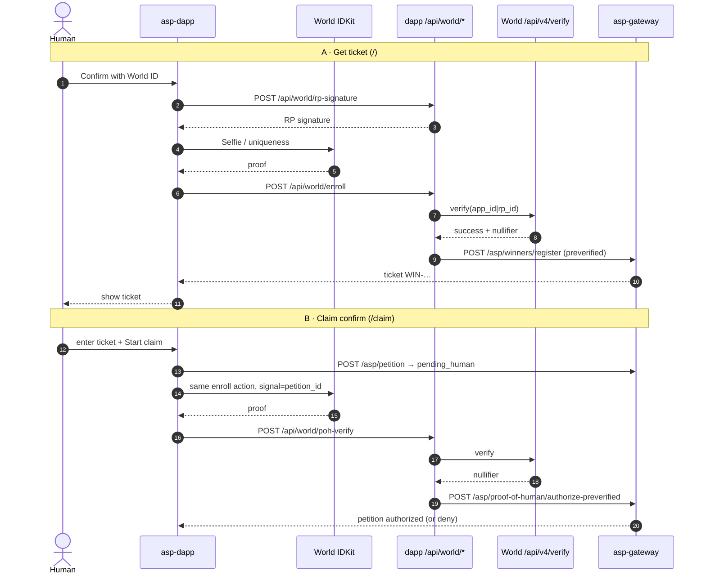
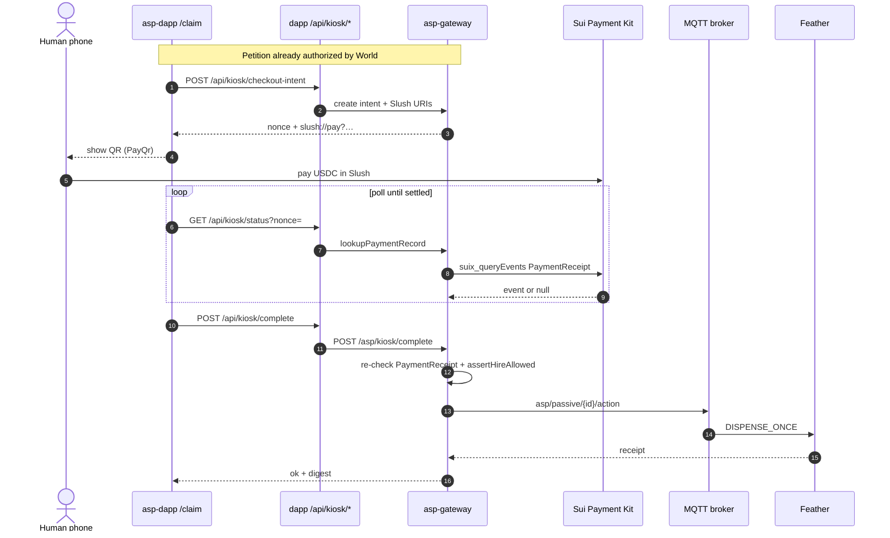
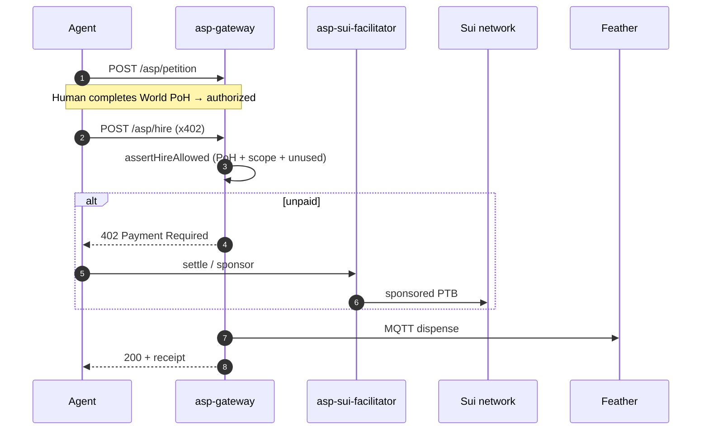
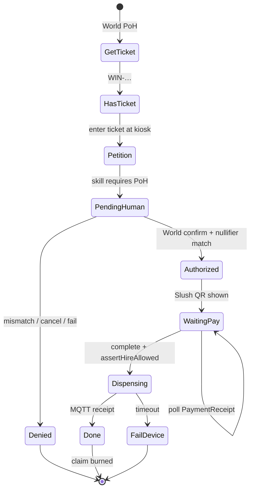

# Asp — AntiScalper Protocol

<div align="center">
  
</div>

**Fair physical releases when agents can buy.**

ETHGlobal Tokyo 2026 · Partner slots: **World** + **Sui**

One eligible human. One capsule. Real motor. Payment alone is not enough — Asp answers *who*, *what*, and *once* before anything spins.

---

## The problem

A limited merch drop. Fans want an agent to grab a capsule. Scalpers want the same.

| Question | Why USDC alone fails |
|---|---|
| **Who is entitled?** | A wallet is not a person |
| **What may they buy?** | One unit from *this* machine, this release |
| **Has it been used?** | Second wallet / agent / retry must fail |

Asp’s answer is two load-bearing sponsors:

1. **World** — Proof of Human as the trust event (ticket + claim + agent gate)
2. **Sui** — programmable settlement the machine can wait on (Payment Kit / Slush + x402)

Remove either rail and “pay → dispense” is just a faster scalper.

---

## Architecture (big picture)



| Package | Job |
|---|---|
| [`asp-dapp`](asp-dapp) | Ticket UI, claim UI, World API routes, Payment Kit poll |
| [`asp-gateway`](asp-gateway) | Winners + petitions, PoH authorize, kiosk complete, x402 hire |
| [`asp-devices`](asp-devices) | ESP32 — one spin per authorized MQTT action |
| [`asp-sui-facilitator`](asp-sui-facilitator) | Sponsored gas for x402 settlements |
| [`@altaga/x402-sui`](https://www.npmjs.com/package/@altaga/x402-sui) | Exact Sui x402 client / server / facilitator schemes |

---

## Demo surfaces

| Route | Flow |
|---|---|
| `/` **Get ticket** | World PoH → `WIN-…` code |
| `/claim` **Claim** | Ticket → World confirm → Slush QR → motor |
| `/v1` **Backup** | World → Slush → motor (no pre-ticket) |

<div align="center">
  
</div>
<div align="center"><i>World — Get ticket</i></div>

<br/>

<div align="center">
  
</div>
<div align="center"><i>World + Sui — Claim</i></div>

<br/>

<div align="center">
  
</div>
<div align="center"><i>Backup — same gates, no pre-ticket</i></div>

---

# Sponsor 1 — World (IDKit + Agents)

### Why World is essential

Without World, any hot wallet or agent key can claim. Fair scarce access dies.

World is the **proportionate credential at the moment access changes**:

- enroll (ticket) and claim (kiosk) both verify against World’s portal
- agent-mediated purchase still requires a **live human** approval
- deny / cancel / fail ⇒ **no pay, no motor** (fail-closed)

### End-to-end World flow



### Deny paths (product proof)

| Error | Effect |
|---|---|
| `world-verify-failed` | Portal reject → no authorize |
| `nullifier-mismatch` | Different human than signup → no pay |
| `already-claimed` / `claim-already-used` | Entitlement burned → motor idle |
| `signal-mismatch` | Proof not bound to this petition |
| cancelled / expired IDKit | Protected action never starts |

### Code — fail-closed verify

Gateway never trusts client `onSuccess` alone:

```1:4:asp-gateway/src/services/policy/pohVerify.js
/**
 * Fail-closed World ID verify. Never treat client onSuccess alone as auth.
 * World ID 4.0 docs: POST /api/v4/verify/{rp_id} with IDKit payload as-is.
 */
```

```31:46:asp-gateway/src/services/policy/pohVerify.js
export async function verifyWorldProof(idkitResponse, { expectedEnvironment, action, signal } = {}) {
  const rpId = (process.env.WORLD_RP_ID || process.env.EXPO_PUBLIC_WORLD_RP_ID || '').trim();
  const appId = (process.env.WORLD_APP_ID || process.env.EXPO_PUBLIC_WORLD_APP_ID || '').trim();
  // Official IDKit guide uses {rp_id}; some RPs verify with {app_id}. Try both.
  const verifyIds = [];
  if (rpId && rpId.startsWith('rp_')) verifyIds.push(rpId);
  if (appId && appId.startsWith('app_')) verifyIds.push(appId);
  if (verifyIds.length === 0) {
    return {
      verified: false,
      nullifier: null,
      session_id: null,
      raw: null,
      error: 'WORLD_RP_ID / WORLD_APP_ID not configured for verify',
    };
  }
```

### Code — nullifier → one ticket

```21:47:asp-gateway/src/services/policy/winners.js
export function enrollWinner({ nullifier, release_id = 'tokyo2026-capsule-v1' }) {
  const key = String(nullifier || '').toLowerCase();
  if (!key) return { ok: false, error: 'missing-nullifier' };

  const existingTicket = ticketByNullifier.get(key);
  if (existingTicket) {
    const existing = winnersByTicket.get(existingTicket);
    return {
      ok: true,
      already: true,
      winner: publicWinner(existing),
    };
  }

  const ticket = makeTicket();
  const record = {
    ticket,
    nullifier: key,
    release_id: String(release_id || 'tokyo2026-capsule-v1'),
    // ...
  };
  winnersByTicket.set(ticket, record);
  ticketByNullifier.set(key, ticket);
  return { ok: true, already: false, winner: publicWinner(record) };
}
```

### Code — dapp verifies, then gateway authorizes (preferred claim path)

Fresh staging token lives on the dapp; gateway receives a **preverified** authorize:

```1:4:asp-dapp/src/app/api/world/poh-verify+api.ts
/**
 * POST /api/world/poh-verify
 * Verify World proof on the dapp (fresh staging token + UA), then authorize on gateway.
 * Avoids gateway-side World verify (stale/missing WORLD_STAGING_VERIFICATION_TOKEN → 403).
 */
```

```132:155:asp-dapp/src/app/api/world/poh-verify+api.ts
    const verified = await verifyWithWorld(idkitResponse, action, signal);
    if (!verified.ok) {
      return Response.json(verified, { status: verified.status || 403 });
    }
    // ...
    const gwRes = await fetch(`${base}/asp/proof-of-human/authorize-preverified`, {
      method: 'POST',
      headers: { 'Content-Type': 'application/json' },
      body: JSON.stringify({
        petition_id,
        ticket: ticket || undefined,
        nullifier: verified.nullifier,
        session_id: verified.session_id || undefined,
        signal,
        preverified: true,
      }),
    });
```

### World file map

| File | Role |
|---|---|
| [`asp-dapp/src/features/world/WorldVerifyModal.tsx`](asp-dapp/src/features/world/WorldVerifyModal.tsx) | IDKit Selfie UI + RP signature |
| [`asp-dapp/src/app/api/world/rp-signature+api.ts`](asp-dapp/src/app/api/world/rp-signature+api.ts) | Server-only RP sign |
| [`asp-dapp/src/app/api/world/enroll+api.ts`](asp-dapp/src/app/api/world/enroll+api.ts) | Signup verify → register winner |
| [`asp-dapp/src/app/api/world/poh-verify+api.ts`](asp-dapp/src/app/api/world/poh-verify+api.ts) | Claim verify → authorize-preverified |
| [`asp-gateway/src/services/policy/pohVerify.js`](asp-gateway/src/services/policy/pohVerify.js) | Fail-closed portal verify |
| [`asp-gateway/src/services/policy/winners.js`](asp-gateway/src/services/policy/winners.js) | Ticket ↔ nullifier registry |
| [`asp-gateway/src/services/policy/store.js`](asp-gateway/src/services/policy/store.js) | Petition `pending_human` → `authorized` |
| [`asp-gateway/src/services/policy/routes.js`](asp-gateway/src/services/policy/routes.js) | `/asp/winners/*`, `/asp/proof-of-human/*` |

---

# Sponsor 2 — Sui (DeFi & Payments)

### Why Sui is essential

Without Sui, entitlement has nowhere honest to settle. The booth cannot wait on a real payment rail — only on a boolean the client invents.

Sui gives Asp:

- **Payment Kit + Slush QR** — phone pays USDC at the kiosk; PC waits for `PaymentReceipt`
- **x402 hire + facilitator** — agent path with gas sponsorship
- **PoH gate before settle / dispense** — `assertHireAllowed` runs *before* money moves into actuation

### End-to-end Sui kiosk pay → motor



### Parallel path — agent x402 hire



### Code — Slush deep link from Payment Kit URI

```27:55:asp-gateway/src/services/kiosk/paymentKit.js
export function buildSlushPayUrl({
  receiver,
  amount,
  coinType,
  nonce,
  label,
  message,
  registryName = DEFAULT_REGISTRY_NAME,
}) {
  const suiUri = createPaymentTransactionUri({
    receiverAddress: receiver,
    amount: BigInt(amount),
    coinType,
    nonce,
    label,
    message,
    registryName,
  });
  const query = String(suiUri).includes('?')
    ? String(suiUri).slice(String(suiUri).indexOf('?') + 1)
    : '';
  // Deep link opens Slush natively on phone; HTTPS is universal fallback.
  return {
    deepLink: `slush://pay?${query}`,
    webUrl: `https://my.slush.app/pay?${query}`,
    suiPay: String(suiUri),
    /** Primary for QR / open = deep link */
    payUrl: `slush://pay?${query}`,
  };
}
```

### Code — wait on real settlement (not `paid=true`)

```77:117:asp-gateway/src/services/kiosk/paymentKit.js
/**
 * Resolve Payment Kit settlement via PaymentReceipt events.
 * Avoids SuiGrpcClient — that path was crashing the host (Cloudflare 502) on complete.
 */
export async function lookupPaymentRecord({ nonce, amount, coinType, receiver, registryName }) {
  void coinType;
  void registryName;
  const eventType = `${PAYMENT_KIT_PACKAGE}::payment_kit::PaymentReceipt`;
  const result = await rpc('suix_queryEvents', [
    { MoveEventType: eventType },
    null,
    80,
    true,
  ]);
  // … match nonce (+ amount / receiver) → digest or null
  return null;
}
```

### Code — hire is PoH-gated before x402

```149:192:asp-gateway/src/services/policy/store.js
export function assertHireAllowed({ skill, body, skipRequesterMatch = false }) {
  // …
  if (petition.status !== 'authorized') {
    // pending_human / expired / revoked / denied → block hire & dispense
```

`POST /asp/hire` calls `assertHireAllowed` **before** the facilitator settles (`asp-gateway/src/services/x402/routes.js`).

### Sui deny paths

| Signal | Meaning |
|---|---|
| `payment-not-found` (402) | QR not settled yet — keep polling |
| `pending-human` | Tried to pay/hire before World authorize |
| `assertHireAllowed` fail | Scope / expiry / claim already used |
| `esp32-no-receipt` (504) | Motor path timed out |
| `lab-intent-no-dispense` | Lab QR never runs the motor |

### Sui file map

| File | Role |
|---|---|
| [`asp-gateway/src/services/kiosk/paymentKit.js`](asp-gateway/src/services/kiosk/paymentKit.js) | Slush URI + `PaymentReceipt` lookup |
| [`asp-gateway/src/services/kiosk/routes.js`](asp-gateway/src/services/kiosk/routes.js) | `/asp/kiosk/intent`, `/complete`, `/dispense` |
| [`asp-dapp/src/app/api/kiosk/checkout-intent+api.ts`](asp-dapp/src/app/api/kiosk/checkout-intent+api.ts) | Checkout QR intent |
| [`asp-dapp/src/app/api/kiosk/status+api.ts`](asp-dapp/src/app/api/kiosk/status+api.ts) | Poll settlement |
| [`asp-dapp/src/app/api/kiosk/complete+api.ts`](asp-dapp/src/app/api/kiosk/complete+api.ts) | Complete → gateway dispense |
| [`asp-dapp/src/features/control/PayQr.tsx`](asp-dapp/src/features/control/PayQr.tsx) | QR UI |
| [`asp-dapp/src/features/control/useCheckoutFlow.ts`](asp-dapp/src/features/control/useCheckoutFlow.ts) | Claim state machine |
| [`asp-gateway/src/services/x402/routes.js`](asp-gateway/src/services/x402/routes.js) | `POST /asp/hire` + facilitator |
| [`asp-sui-facilitator`](asp-sui-facilitator) | Gas sponsorship microservice |

---

## Combined product loop



**Second claim with the same entitlement must fail.** That beat is the product.

---

## Partner map (ETHGlobal)

| Slot | Partner | What Asp proves in code |
|---|---|---|
| 1 | **World** | IDKit + Agents · portal verify · ticket/nullifier · authorize-preverified · deny paths |
| 2 | **Sui** | Payment Kit / Slush settlement wait · x402 hire + facilitator · PoH before actuation |

---

## Quick start

```bash
# UI
cd asp-dapp && npm install && npx expo start --web --port 8087
# → http://localhost:8087   /claim   /v1

# Gateway (separate terminal)
cd asp-gateway && cp .env.example .env   # fill keys locally — never commit
npm install && npm start
```

Env templates: [`asp-dapp/.env.example`](asp-dapp/.env.example) (if present), [`asp-gateway/.env.example`](asp-gateway/.env.example).  
Agents integrating over HTTP: [`AGENT.md`](./AGENT.md). Booth steps: [`SIMULATOR.md`](./SIMULATOR.md).

---

<div align="center">
  <sub>ETHGlobal Tokyo 2026 · World · Sui · AntiScalper Protocol</sub>
</div>
