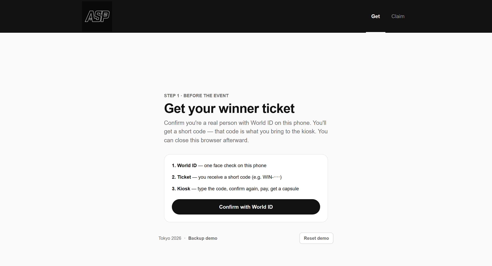
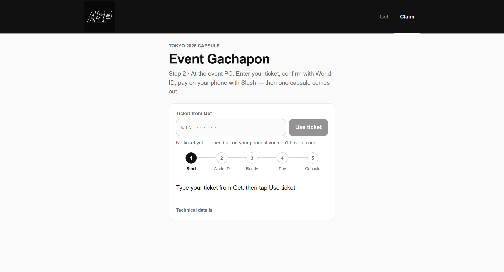
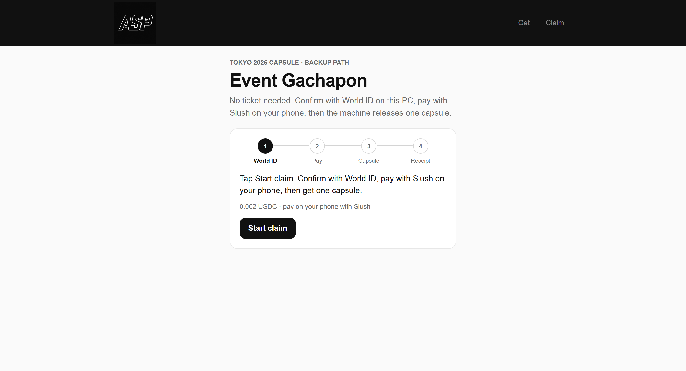

# Asp booth walkthrough

Light guide for ETHGlobal judges. Three screens, one machine.

---

## Screens

### 1. Get ticket — `/`

World Proof of Human once → you get a **winner ticket**. Bring the code to the kiosk (not the browser).



### 2. Claim capsule — `/claim`

Enter the ticket → confirm human → pay with **Slush / Payment Kit QR** → motor dispenses **one** capsule.



### 3. Backup demo — `/v1`

No pre-issued ticket. Same loop on the spot: World → pay → dispense. Useful if signup is busy.



---

## What you should see work

1. Face check completes (World sandbox / event path).
2. Ticket is unique — reuse is rejected.
3. QR pay settles on Sui; the UI waits on real settlement (not a fake `paid=true`).
4. Motor spins **once** per successful claim.
5. Receipt / explorer link appears after dispense.

---

## Local UI

```bash
cd asp-dapp
npx expo start --web --port 8087
```

| URL | Job |
|---|---|
| `http://localhost:8087/` | Get ticket |
| `http://localhost:8087/claim` | Kiosk claim |
| `http://localhost:8087/v1` | Backup demo |

Hardware + gateway must be up for a full dispense. UI-only review still shows the full Asp claim flow.
